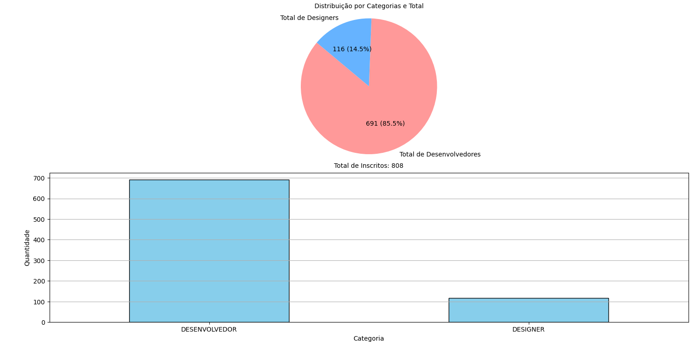

<!DOCTYPE html>
<html lang="en">

<body>
    

        

            <h1>Análise de Dados de Inscritos</h1>
            

            Este projeto tem como objetivo realizar uma análise de dados de inscritos para a prova
            da Apple Academy que ocorrera entre os dias 16 a 18 de outubro de 2024, extraindo 
            informações de um arquivo PDF e gerando gráficos para visualização dos dados. Os dados 
            extraídos incluem matrícula, categoria (desenvolvedor ou designer), laboratório, data, 
            dia da semana e horário da prova.
            

        

        

            <h2>Tecnologias Utilizadas</h2>
            <ul>
                <li>python</li>
                <li>pandas</li>
                <li>matplotlib</li>
                <li>pdfplumber</li>
            </ul>
            <h2>Instalação</h2>
            
Para rodar este projeto, você precisa ter Python instalado na sua máquina. Você pode instalar as
                dependências necessárias usando <code>pip</code>. Execute o seguinte comando no terminal:

            <blockquote>
                <strong>⚠ Atenção:</strong> Para executar os próximos comandos (<code>py</code>), é necessário que o
                Python esteja instalado em sua máquina.
                Recomendo a versão <strong>3.11</strong>, que pode ser encontrada no site oficial:
                <a href="https://www.python.org/downloads/" target="_blank">python.org</a>
            </blockquote>
             
            <pre><code>py -m venv .venv</code></pre>
            <pre><code>.\.venv\Scripts\activate</code></pre>
            <pre><code>py -m pip install -r requirements.txt</code></pre>
            <h2>Uso</h2>
            <ol>
                <li>
                    <strong>Extração de Dados:</strong>
                    <ul>
                        <li>Certifique-se de que o arquivo PDF com os dados está no diretório apropriado.</li>
                        <li>O script vai ler o PDF e extrair as informações em um formato estruturado.</li>
                    </ul>
                </li>
                <li>
                    <strong>Análise e Visualização:</strong>
                    <ul>
                        <li>Execute o script Python dentro do venv (virtual enviroment) para realizar a análise e gerar os gráficos.</li>
                         
                        <pre><code>.\.venv\Scripts\activate</code></pre>
                        <pre><code>py .\src\main.py</code></pre>
                        <li>O gráfico de pizza mostra a distribuição das categorias e o total de registros.</li>
                        <li>O gráfico de barras apresenta a quantidade de inscritos por categoria (Desenvolvedores e
                            Designers).</li>
                    </ul>
                </li>
            </ol>
            <h2>Gráficos Gerados</h2>
            <h3>Gráfico de Pizza</h3>
            
O gráfico de pizza exibe a distribuição de categorias e o total de registros. Ele mostra a quantidade e a
                porcentagem de:

            <ul>
                <li>Total de Desenvolvedores</li>
                <li>Total de Designers</li>
            </ul>
            <h3>Gráfico de Barras</h3>
            
O gráfico de barras mostra a quantidade de inscritos por categoria. Os rótulos das categorias estão
                dispostos horizontalmente para melhor legibilidade.

            <h3>Exemplo de Gráficos</h3>
            
Os gráficos abaixo são exemplos de como os dados podem ser visualizados.

            

                
            

        

    

</body>

</html>